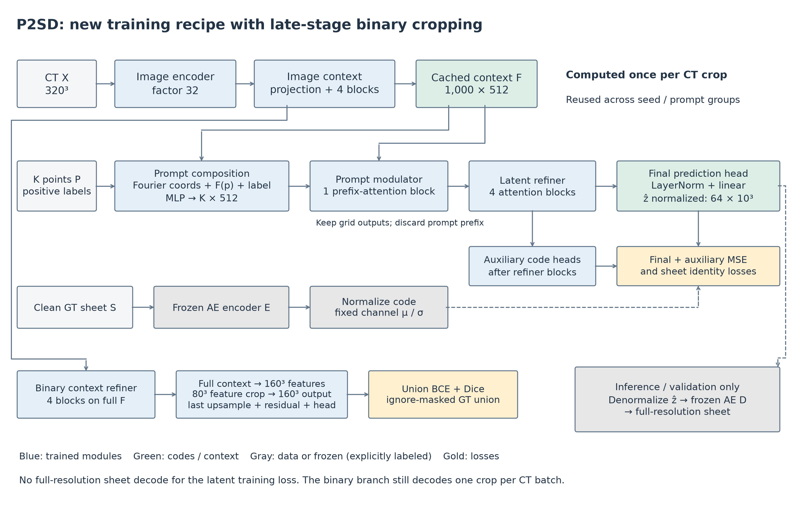

# Training from scratch

Run commands from the repository root after installing the dependencies in the
main README. Set `CUDA_VISIBLE_DEVICES` to your chosen GPU. These instructions
train a new AE, estimate its latent statistics, and train P2SD and its binary
branch from random weights. They need no released checkpoints.

This is a **new baseline recipe**, not an exact replay of 0058: that checkpoint
used earlier P2SD and foreground warm starts. The architecture and active losses
match the reference. The new recipe moves binary cropping to the final
upsampling stage and uses the co-trained binary head for automatic seed proposal.
It uses a uniform initial LR of `1e-4`,
500-step warmup, and cosine decay to 5% of that LR. Its final accuracy has not
been measured. Historical configurations remain in `provenance/`.

## 1. Prepare training data

Provide the intended training cases in this layout:

```text
data/raw/
  imagesTr/<case>_0000.nii.gz
  labelsTr/<case>.nii.gz
```

Images contain integer CT intensities in `[0,255]`. Labels use `0=background`,
`1=sheet`, `2=unannotated`. Their array shapes and axes must agree. The converter
reads NIfTI array axes without reorientation; this project uses `[X,Y,Z]`. For
original TIFF stacks stored `[Z,Y,X]`, transpose **both** image and label using
`array.transpose(2,1,0)` before writing NIfTI. Do not standardize CT intensities
or convert ignore label 2 into foreground.

Choose the data split before experimentation. Include only training-source
cases here; the 106 released evaluation cases do not belong in this directory.
The converter makes a deterministic 90/10 case split. For a spatially disjoint
evaluation, replace `manifest_train.jsonl` and `manifest_val.jsonl` with your
predeclared case lists before the repair/cache steps; keep their union in
`manifest_all.jsonl`. A random case split alone does not establish spatial
independence of crops from the same scroll.

```bash
python -m vesuvius_p2sd.data.convert_dataset \
  --source_raw_dir data/raw --output_root datasets/vesuvius_train_raw \
  --component_policy never --image_dtype uint8 \
  --erased_border_width 5 --val_fraction 0.1 --seed 42

python -m vesuvius_p2sd.data.repair_component_topology \
  --source_root datasets/vesuvius_train_raw \
  --output_root datasets/vesuvius_train_t6 --workers 4

python -m vesuvius_p2sd.data.build_ignore_masks \
  --dataset_root datasets/vesuvius_train_t6 --workers 4

python -m vesuvius_p2sd.data.cache_component_stats \
  --dataset_root datasets/vesuvius_train_t6 --workers 4
```

Conversion separates the foreground into 6-connected components. These are
training sheet proxies, not guaranteed physical sheet identities. Repair uses
guarded per-component closing and records unresolved defects in
`topology_repair_report.json`. It does not modify the source data. Use the
unrepaired, official annotations for reported benchmark evaluation. If existing
reviewed sheet IDs are available, provide them through the converter's
`--component_dir`/`--component_policy require_match` interface instead of deriving
components; its expected file name is `<case>_cc_t5.npy` in native array shape.

The ignore step is required for the joint binary objective. It produces
`manifest_train_ignore.jsonl` and `manifest_val_ignore.jsonl` and packed ignore
arrays. The loader reads manifest file paths relative to the working directory;
keep running from the repository root or prepare manifests with absolute paths.

## 2. Train the single-sheet AE

```bash
python -m vesuvius_p2sd.train.train_ae \
  --config_path configs/training/ae_scratch.yaml
```

The recipe uses 320-cubed crops, batch size 3, 150 epochs, BF16 and AdamW with
initial LR `5e-5`. It includes all reference AE heads, denoising and repulsion.
Its same-case pair sampler needs at least two training cases and batch size at
least 2. Outputs are under `runs_from_260914/training/ae_scratch/`.

Distance targets default to `cpu_scipy` so the documented dependencies suffice.
For the optional GPU EDT implementation, install compatible CuPy/cuCIM and set
`data.distance_target_backend=gpu_cucim`. This is a backend choice, not a change
to the distance objective. Adjust worker count for available host memory.

The sparse encoder remains available in `configs/training/ae_sparse_scratch.yaml`.
It requires a working CUDA/torchsparse installation, uses occupied-voxel
computation, and keeps the shared dense decoder and heads. It is an experimental
encoder alternative, not compatible with the released dense encoder weights.
The sparse runtime is not part of the default dependency installation.

## 3. Estimate normalization from the new AE and training split

```bash
python -m vesuvius_p2sd.research.estimate_ae_latent_stats \
  --config_path configs/training/p2sd_scratch.yaml \
  --split train --max_batches 64 \
  --output_path runs_from_260914/training/ae_scratch/latent_stats.json
```

This reads the new AE checkpoint; it does not need a P2SD checkpoint or preexisting
statistics. It samples sheet targets with the P2SD pair sampler. Recompute the
statistics whenever the AE changes. The released `configs/latent_stats.json`
belongs to the released AE and must not be reused for a newly trained one.

## 4. Train P2SD and the binary branch jointly

```bash
python -m vesuvius_p2sd.train.train_p2sd \
  --config_path configs/training/p2sd_scratch.yaml
```

The new AE is frozen. The image encoder, image context, point modules, latent
heads and binary branch start from random weights. Each CT crop yields four
sheet/prompt pairs with 1–8 positive points. With
`p2sd.dense_aux.crop_stage=second_last`, the binary branch refines the full
10³ context and decodes the complete field through the 160³ feature stage.
It then crops 80³ features and applies the final ×2 upsampling, residual block
and occupancy head to produce a **160³ output crop** for supervision.
`crop_grid=5` specifies the output extent (5 × 32 = 160), not a bottleneck crop
in this mode. Earlier decoder stages therefore retain the full crop context;
only the last stage sees the training crop boundary. This costs more memory
than cropping at 10³, while avoiding artificial boundaries in earlier stages.



No full-resolution prompted sheet decoding is required by the active latent
training objective. Validation still decodes sheet masks.

`last.pt` contains P2SD weights and optimizer state; `dense_last.pt` contains the
binary branch. Both are needed to resume joint training. Every 1,000 steps a
matched checkpoint pair is saved in `checkpoints/step_XXXXXX/` (latest three
retained). Logs, resolved configuration, provenance and validation artifacts
are in the same run directory. NIFTI visualization is enabled; projection PNGs
are disabled in these recipes. See `docs/ARCHITECTURE.md` for modules and losses.

## 5. Use the co-trained binary head for automatic seeds

```bash
python plats.py automatic \
  --run_dir runs_from_260914/training/p2sd_scratch \
  --image /path/to/preprocessed_ct_uint8.npy --output outputs/new_model
```

This loads `last.pt` and `dense_last.pt` from the same step, plus the target AE
and latent statistics recorded in the training checkpoint. It computes CT
features/context once, decodes the binary union on the full volume, samples
foreground seeds, and reuses that context for P2SD code prediction and clustering.
There is no separately trained foreground proposer in this path. Inference has
no binary training crop: the co-trained head decodes the full 320³ volume.

For an intermediate evaluation during training, select an immutable snapshot:

```bash
python plats.py automatic \
  --run_dir runs_from_260914/training/p2sd_scratch \
  --checkpoint_dir runs_from_260914/training/p2sd_scratch/checkpoints/step_001000 \
  --image /path/to/preprocessed_ct_uint8.npy --output outputs/step_001000
```

The loader rejects a mismatched P2SD/binary step. Prompted inference also accepts
`--run_dir`/`--checkpoint_dir`, and does not require a binary checkpoint. Source
paths, steps and SHA256 hashes are saved in `run.json`. Keep the target AE and
statistics available at their recorded paths. Relative config paths resolve
against the repository root.

The initial automatic thresholds remain in `configs/automatic.json`; they are
not validated optima for a new model. Calibrate them on the training-validation
split. Omitting `--run_dir` intentionally retains the frozen released-model
reproduction path, including its historical separate proposer.

## Optional query supervision and AE consistency

Keep the P2SD-owned `latent_distance_head` and its GT-distance Smooth L1 loss.
`p2sd.latent_distance.hidden_dim` creates that head;
`p2sd.loss.latent_distance.weight` enables supervision from the GT sheet's EDT.
This differs from `p2sd.loss.coordinate_query`, which distills the frozen AE's
query predictions and is retained as a separate ablation. The GT-distance branch
currently requires the optional GPU EDT dependencies (CuPy/cuCIM).

The query sampling/occupancy-target utilities and implicit AE occupancy/distance
head are retained too. At present the standalone P2SD query head predicts
**distance only**; a separate GT-supervised P2SD occupancy-query head is not wired
in this checkout. No query-supervision code is removed. The new default recipe
keeps these optional objectives disabled rather than silently changing its loss.

Flip/rotation consistency can also be added to AE training. It is not currently
implemented or enabled by these configs. A proposed output-space term compares
`A(S_tilde)` with `inverse_g(A(g(S_tilde)))`, where `A = sigmoid(D(E(.)))`,
`S_tilde` is one corrupted input sheet and `g` is an exact flip/90° rotation.
Use the transformed **same** corruption and disable latent noise for the
consistency forward passes (or define a deliberate noise-invariance objective).
Continue supervising both views against their clean GT sheets. Reconstruction
losses prevent a trivial constant prediction from satisfying consistency alone.

Start with a small loss weight after reconstruction has stabilized, applying it
periodically if full decoding is costly. Do not assume `E(g(S)) = g(E(S))` for
this learned latent representation: latent equivariance is a separate ablation.
A query-space version could compare occupancy/distance at corresponding `q` and
`g(q)` with GT supervision, reducing decoder cost, but should follow validation
of query-head accuracy. Any retrained AE needs fresh latent statistics and
P2SD training against its new code space.

## Stop and resume

For a graceful stop between steps:

```bash
touch runs_from_260914/training/p2sd_scratch/stop_requested
```

After the process exits, remove the sentinel and resume from a matching pair:

```bash
rm runs_from_260914/training/p2sd_scratch/stop_requested
python -m vesuvius_p2sd.train.train_p2sd \
  --config_path configs/training/p2sd_scratch.yaml \
  training.resume_checkpoint_path=runs_from_260914/training/p2sd_scratch/last.pt \
  p2sd.dense_aux.init_checkpoint=runs_from_260914/training/p2sd_scratch/dense_last.pt \
  training.resume_optimizer=true training.reset_step_on_resume=false
```

Use the same total training horizon when resuming a stopped schedule. A new
longer schedule is a separate continuation experiment; its LR should be chosen
explicitly. The sampler/RNG stream is not checkpointed for bitwise replay.
AE stopping uses the same sentinel; resume it with
`training.resume_checkpoint_path=.../ae_scratch/last.pt`.

## Validate installation before a long run

`--dry_run` resolves configurations and writes run metadata; it does not execute
the model or validate that the dataset/checkpoints exist. Use
`python tools/check_training_recipe.py` for a short CPU check with synthetic
64-cubed data, exercising AE optimization, latent statistics, and joint P2SD
optimization. This checks plumbing, not 320-cubed GPU performance or convergence.
With the temporary output directory printed by that check, also run:

```bash
python tools/check_joint_inference.py \
  --run_dir /tmp/plats-train-check-XXXXX/p2sd_scratch
```

This checks matching checkpoint loading, identical binary predictions with
cached context, and identical clustering results without a second CT encode.

The public CLI uses released weights when `--run_dir` is omitted and the new
co-trained stack when it is supplied. Keep these experiment identities separate;
do not replace released weights or reuse release hashes for new models.
